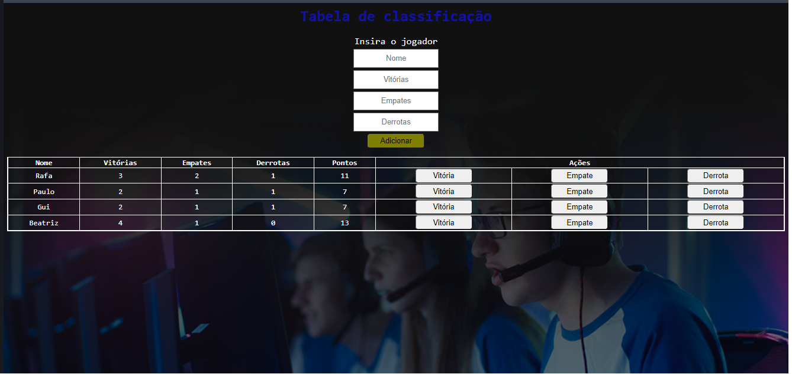

## Sobre o projeto

Neste projeto, o usuário tem que inserir o nome do jogador, número de vitórias, empates, derrotas e os pontos são calculados numa função no JavaScript. 

No app.js implementei as funções:

**lerDados()** - pega os valores da tela;

**validaCampo()** - verifica se o nome não está vazio;

**adicionarJogador()** - adiciona o jogador numa lista;

**exibeJogadoresNaTela()** - joga na tela os jogadores que são adicionados na lista;

## Visual do projeto

  

