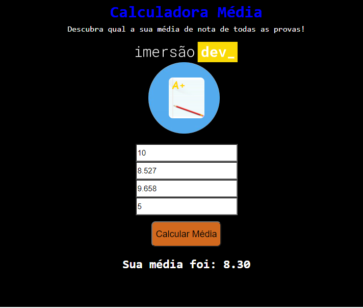

# Imersão em Front-end na Alura

Aulas com projetos práticos ministrados pelos instrutores Rafaella Ballerini, Gui Lima e Paulo Silveira.

## Aula 01
Você vai aprender o que são variáveis e como realizar operações.

Projeto: **Calculadora de média**

## Aula 02
Você vai praticar mais JavaScript, criando um conversor de moedas em uma página web.

Projeto: **Conversor de moedas**

## Aula 03
Você vai criar um jogo de adivinhação e se aprofundar ainda mais em lógica de programação.

Projeto: **Mentalista**

## Aula 04
Você vai trabalhar com listas e estruturas de repetições. São funcionalidades que toda pessoa que programa usa com muita frequência.

Projeto: **AluraFlix**

## Aula 05
Você vai repassar o que viu na aula anterior e exercitar o que aprendeu, modificando o Aluraflix para continuar integrando o HTML e o JavaScript.

## Aula 06
Você vai criar uma tabela de classificação, manipular valores, e aprender o que são "objetos" no JavaScript.

Projeto: **Tabela de classificação**

## Aula 07
Desenvolver um jogo de cartas completamente do zero, o Super Trunfo. Exercitar as habilidades criando cartas, definindo atributos e escolhendo um vencedor.

## Aula 08
Evoluir o projeto que você começou ontem. Aprender como manipular o CSS e exibir as suas cartas na tela.

Projeto: **Super Trunfo**

## Aula 09
Criar o seu próprio portfólio. Você vai conhecer o Figma, uma plataforma de design online, além de manipular o HTML e o CSS para dar forma à sua própria página de projetos da Imersão.

Projeto: **Portfólio**

# Calculadora de Média

  

