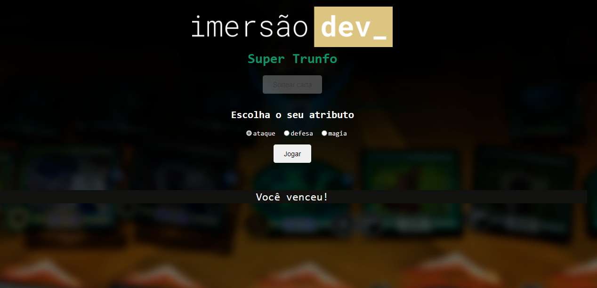

# Aula 7 - Super Trunfo
Neste jogo é sorteado uma carta para o adversário e você escolhe uma opção de ataque, defesa ou magia.
Aquele que tiver uma pontuação da opção escolhida maior, vence o jogo.

  

